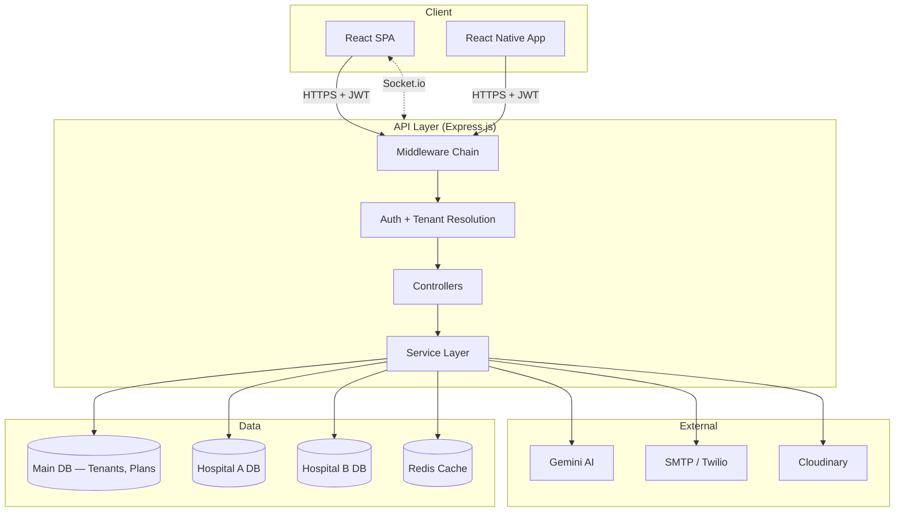

<div align="center">
  <h1>MedicaLink HMS</h1>
  <p><strong>Enterprise Multi-Tenant Hospital Management System</strong></p>
  <p><em>AI-Assisted · Cloud-Native · Real-Time · HIPAA-Ready</em></p>

  <p>
    <a href="https://github.com/harisx404/MedicaLink-HMS/actions"></a>
    <a href="https://github.com/harisx404/MedicaLink-HMS/blob/main/LICENSE"></a>
    
    
    
    
    
    
  </p>
</div>

---

## Overview

MedicaLink HMS is a multi-tenant B2B SaaS hospital management platform. It manages hospital operations from patient registration and clinical consultations to pharmacy dispensing, laboratory workflows, billing, emergency triage, and telemedicine.

Built with a database-per-tenant architecture, each hospital operates in data isolation while sharing the application infrastructure. The platform supports 15 user roles, 25+ clinical and administrative modules, and 200+ views.

---

## Key Features

| Category | Highlights |
|----------|-----------|
| **Multi-Tenant SaaS** | Database-per-tenant isolation, tenant-scoped middleware, subscription management |
| **Authentication** | JWT HttpOnly cookies, refresh token rotation, TOTP 2FA, account lockout protection |
| **Patient Management** | Auto-generated UHID, duplicate detection, patient portal with AI chatbot |
| **Clinical Workflows** | SOAP consultations, prescription builder, ICD-10 coding, AI clinical summaries |
| **Pharmacy** | FEFO batch dispensing, narcotics register, purchase orders, GRN processing |
| **Laboratory** | Sample collection, result entry with delta checks, pathologist verification |
| **Billing & Finance** | Multi-currency invoicing, insurance claims, payment tracking, financial reports |
| **Emergency & ICU** | Manchester triage, real-time ambulance tracking, ventilator parameter monitoring |
| **Telemedicine** | WebRTC video consultations, virtual waiting room |
| **Real-Time** | Socket.io live queues, notifications, bed tracking, schedule updates |
| **AI Integration** | Gemini-powered clinical summaries, drug interaction checks, predictive analytics |
| **Mobile** | React Native (Expo) app for patients and doctors |

---

## Security Architecture

| Layer | Implementation |
|-------|---------------|
| **Authentication** | JWT access tokens (in-memory) + HttpOnly refresh cookies with rotation |
| **Authorization** | RBAC (15 roles) + ABAC (resource-level permission checks) |
| **Input Validation** | Zod schemas on every endpoint |
| **NoSQL Injection** | express-mongo-sanitize on all request bodies |
| **XSS Prevention** | Custom XSS middleware + DOMPurify on frontend |
| **Rate Limiting** | Tiered limits — auth: 5/15min, API: 300/min, AI: 20/min |
| **Data Encryption** | AES-256-GCM for PII fields (SSN, insurance IDs) |
| **CSRF** | SameSite cookie policy + origin validation |
| **Audit Trail** | Every data access and mutation logged with user, IP, and timestamp |

---

## Tech Stack

### Frontend (`apps/web`)
| Layer | Technology |
|-------|-----------|
| Framework | React 18, Vite, TypeScript 5 |
| State | Redux Toolkit, RTK Query |
| Styling | Tailwind CSS v3, shadcn/ui (Radix), Framer Motion |
| Data | React Hook Form, Zod, Recharts, TanStack Table |
| Routing | React Router v7 (lazy-loaded) |

### Backend (`apps/api`)
| Layer | Technology |
|-------|-----------|
| Runtime | Node.js 20 LTS, Express 4, TypeScript 5 |
| Database | Mongoose 8 (database-per-tenant), MongoDB Atlas |
| Caching | Redis (ioredis local / Upstash serverless) |
| Real-Time | Socket.io |
| Security | Helmet, bcryptjs, JWT, express-mongo-sanitize |
| AI | Google Gemini 1.5 Flash |
| Docs | Swagger/OpenAPI 3.0 |

### DevOps & Tooling
| Layer | Technology |
|-------|-----------|
| Monorepo | Turborepo, pnpm workspaces |
| Linting | ESLint 9 (flat config), Husky + lint-staged |
| Testing | Vitest, jsdom, supertest |
| CI/CD | GitHub Actions |
| Deployment | Vercel (serverless) / Docker Compose |

---

## System Architecture



---

## System Limitations & Operational Considerations

- **WebSocket Telemetry:** Socket.io real-time event rooms (ambulance location streams, queue calls) require a persistent Node.js process (`apps/api/src/server.ts` or Docker container) or a Redis Pub/Sub adapter when running serverless functions.
- **Background Cron Tasks:** Periodic appointment reminders and automated inventory alerts rely on job schedulers initialized in `server.ts`.
- **Database Connection Pooling:** Multi-tenant connections are dynamically instantiated and cached in memory. In serverless environments (Vercel), connection caching is managed per function invocation.

---

## Getting Started

### Prerequisites
- Node.js v20+
- pnpm v9+
- Docker & Docker Compose

### Quick Start

```bash
git clone https://github.com/harisx404/MedicaLink-HMS.git
cd MedicaLink-HMS
pnpm install
cp apps/api/.env.example apps/api/.env
pnpm seed:full
pnpm run dev
```

| Service | URL |
|---------|-----|
| Frontend | http://localhost:5173 |
| Backend API | http://localhost:5000 |
| Documentation | [docs/README.md](./docs/README.md) |

---

## Testing

```bash
# Run all tests across the monorepo
pnpm run test

# Run API tests only
pnpm run test --filter api

# Run web tests only
pnpm run test --filter web
```

---

## License

This project is licensed under the MIT License — see the [LICENSE](LICENSE) file for details.
