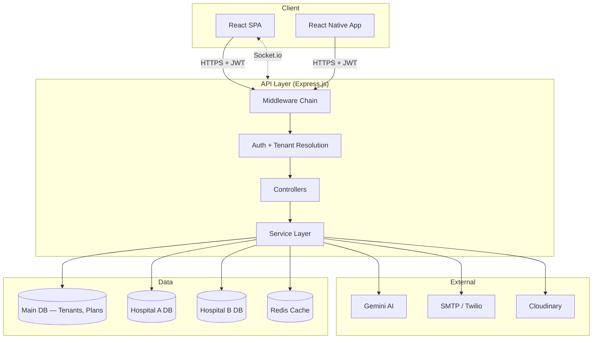

<div align="center">
  
  <h1>🏥 MedicaLink HMS</h1>
  <p><strong>Enterprise-Grade Multi-Tenant Hospital Management System</strong></p>
  <p><em>AI-Powered · Cloud-Native · Real-Time · HIPAA-Ready</em></p>

  <p>
    <a href="https://github.com/harisx404/MedicaLink-HMS/actions"></a>
    <a href="https://github.com/harisx404/MedicaLink-HMS/blob/main/LICENSE"></a>
    
    
    
    
    
    
  </p>
</div>

---

## Overview

MedicaLink HMS is a production-grade, **multi-tenant B2B SaaS** hospital management platform. It manages the complete lifecycle of hospital operations — from patient registration and clinical consultations to pharmacy dispensing, laboratory workflows, billing, emergency triage, and telemedicine — all within a single, real-time, AI-enhanced system.

Built with a **database-per-tenant** architecture, each hospital operates in complete data isolation while sharing the same application infrastructure. The platform supports **15 distinct user roles**, **25+ clinical and administrative modules**, and **200+ pages**.

---

## Key Features

| Category | Highlights |
|----------|-----------|
| **Multi-Tenant SaaS** | Database-per-tenant isolation, tenant-scoped middleware, subscription management |
| **Authentication** | JWT HttpOnly cookies, refresh token rotation, TOTP 2FA, account lockout |
| **Patient Management** | Auto-generated UHID, duplicate detection, patient portal with AI chatbot |
| **Clinical Workflows** | SOAP consultations, prescription builder, ICD-10 coding, AI clinical summaries |
| **Pharmacy** | FEFO batch dispensing, narcotics register, purchase orders, GRN processing |
| **Laboratory** | Sample collection, result entry with delta checks, pathologist verification |
| **Billing & Finance** | Multi-currency invoicing, insurance claims, payment tracking, financial reports |
| **Emergency & ICU** | Manchester triage, real-time ambulance tracking, ventilator parameter charts |
| **Telemedicine** | WebRTC video consultations, virtual waiting room |
| **Real-Time** | Socket.io live queues, notifications, bed tracking, schedule updates |
| **AI Integration** | Gemini-powered clinical summaries, drug interaction checks, predictive analytics |
| **Mobile** | React Native (Expo) app for patients and doctors |

---

## Security Architecture

| Layer | Implementation |
|-------|---------------|
| **Authentication** | JWT access tokens (in-memory) + HttpOnly refresh cookies with rotation |
| **Authorization** | RBAC (15 roles) + ABAC (resource-level permission checks) |
| **Input Validation** | Zod schemas on every endpoint — no unvalidated user input |
| **NoSQL Injection** | express-mongo-sanitize on all request bodies |
| **XSS Prevention** | Custom XSS middleware + DOMPurify on frontend |
| **Rate Limiting** | Tiered limits — auth: 5/15min, API: 300/min, AI: 20/min |
| **Data Encryption** | AES-256-GCM for PII fields (SSN, insurance IDs) |
| **CSRF** | SameSite cookie policy + origin validation |
| **Audit Trail** | Every data access and mutation logged with user, IP, and timestamp |

---

## Tech Stack

### Frontend (`apps/web`)
| Layer | Technology |
|-------|-----------|
| Framework | React 18, Vite, TypeScript 5 |
| State | Redux Toolkit, RTK Query |
| Styling | Tailwind CSS v3, shadcn/ui (Radix), Framer Motion |
| Data | React Hook Form, Zod, Recharts, TanStack Table |
| Routing | React Router v7 (lazy-loaded) |

### Backend (`apps/api`)
| Layer | Technology |
|-------|-----------|
| Runtime | Node.js 20 LTS, Express 4, TypeScript 5 |
| Database | Mongoose 8 (database-per-tenant), MongoDB Atlas |
| Caching | Redis (ioredis local / Upstash serverless) |
| Real-Time | Socket.io |
| Security | Helmet, bcryptjs, JWT, express-mongo-sanitize |
| AI | Google Gemini 1.5 Flash |
| Docs | Swagger/OpenAPI 3.0 |

### DevOps & Tooling
| Layer | Technology |
|-------|-----------|
| Monorepo | Turborepo, pnpm workspaces |
| Linting | ESLint 9 (flat config), Husky + lint-staged |
| Testing | Vitest, jsdom, supertest |
| CI/CD | GitHub Actions |
| Deployment | Vercel (serverless) |
| Infrastructure | Docker Compose (local dev) |

---

## System Architecture



---

## Getting Started

### Prerequisites
- [Node.js](https://nodejs.org/) v20+
- [pnpm](https://pnpm.io/) v9+
- [Docker](https://www.docker.com/) & Docker Compose
- [Git](https://git-scm.com/)

### Quick Start

```bash
# 1. Clone the repository
git clone https://github.com/harisx404/MedicaLink-HMS.git
cd MedicaLink-HMS

# 2. Install dependencies
pnpm install

# 3. Start MongoDB and Redis
docker-compose up -d

# 4. Configure environment
cp .env.example apps/api/.env
cp .env.example apps/web/.env

# 5. Start development servers
pnpm run dev
```

| Service | URL |
|---------|-----|
| Frontend | http://localhost:3000 |
| Backend API | http://localhost:5000 |
| API Documentation | http://localhost:5000/api/docs |

---

## Project Structure

```
MedicaLink-HMS/
├── apps/
│   ├── api/                 # Express.js REST API
│   │   ├── src/
│   │   │   ├── config/      # DB, Redis, Swagger, env validation
│   │   │   ├── controllers/ # Route handlers
│   │   │   ├── middlewares/  # Auth, tenant, rate-limit, validation
│   │   │   ├── models/       # Mongoose schemas
│   │   │   ├── routes/       # Route definitions
│   │   │   ├── services/     # Business logic
│   │   │   ├── sockets/      # Real-time event handlers
│   │   │   └── tests/        # Unit + integration tests
│   │   └── vercel.json       # Serverless deployment config
│   ├── web/                  # React SPA (Vite)
│   │   └── src/
│   │       ├── components/   # Shared UI components
│   │       ├── features/     # Feature modules
│   │       ├── layouts/      # App, Admin, Portal layouts
│   │       ├── pages/        # Route-level pages
│   │       └── store/        # Redux slices + RTK Query APIs
│   └── mobile/               # React Native (Expo)
├── packages/
│   ├── shared/               # Shared TypeScript types and enums
│   ├── eslint-config/        # Shared ESLint configuration
│   └── typescript-config/    # Shared tsconfig bases
├── .github/                  # CI/CD workflows, issue templates
├── CHANGELOG.md              # Version history
├── CONTRIBUTING.md           # Contribution guidelines
└── docker-compose.yml        # Local development infrastructure
```

---

## Testing

```bash
# Run all tests across the monorepo
pnpm run test

# Run API tests only
pnpm run test --filter api

# Run web tests only
pnpm run test --filter web
```

**Current Coverage**: 46 tests passing (41 API + 5 Web)

| Suite | Tests | Coverage |
|-------|-------|----------|
| API Unit (Encryption, ErrorHandler, ApiResponse) | 24 | Core utilities |
| API Integration (Auth, Billing, Pharmacy) | 17 | Critical business flows |
| Web Unit (Redux AuthSlice) | 5 | State management |

---

## API Documentation

Interactive Swagger documentation is available at `/api/docs` when the API server is running. It covers all major endpoint groups:

- **Authentication** — Login, registration, token refresh, 2FA
- **Patients** — Registration, search, profiles
- **Appointments** — Booking, queue management
- **Pharmacy** — Drug inventory, dispensing
- **Laboratory** — Orders, results, verification
- **Billing** — Invoice generation, payments, insurance
- **Emergency** — Triage, ambulance tracking
- **Dashboard** — KPI metrics and analytics

---

## Contributing

See [CONTRIBUTING.md](CONTRIBUTING.md) for development setup, coding standards, and PR process.

## License

This project is licensed under the MIT License — see the [LICENSE](LICENSE) file for details.

---

<div align="center">
  <sub>Built with precision for enterprise healthcare operations.</sub>
</div>
