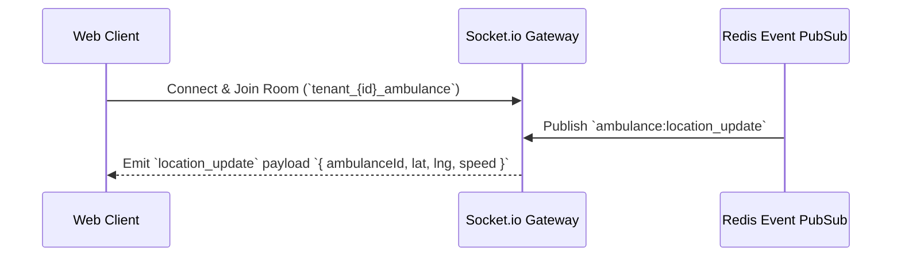

# API & Real-Time Event Reference — MedicaLink HMS

REST API routes, request/response envelopes, authentication headers, and Socket.io event schemas for MedicaLink HMS.

---

## Headers & Response Format

### Required Headers
```http
Authorization: Bearer <JWT_ACCESS_TOKEN>
x-tenant-id: <TENANT_ID>
Content-Type: application/json
```

### Standard Response Envelope
```json
{
  "success": true,
  "message": "Operation executed successfully",
  "data": { ... },
  "pagination": {
    "page": 1,
    "limit": 20,
    "total": 150,
    "totalPages": 8
  }
}
```

---

## REST API Catalog

### 1. Authentication & Multi-Tenancy (`/api/v1/auth`)
| Method | Endpoint | Description | Access |
|---|---|---|---|
| `POST` | `/api/v1/auth/login` | Authenticate user credentials & issue JWT tokens | Public |
| `POST` | `/api/v1/auth/refresh-token` | Rotate refresh token & return new access token | Public |
| `POST` | `/api/v1/auth/logout` | Revoke session & clear HttpOnly cookies | Authenticated |
| `GET` | `/api/v1/auth/me` | Fetch authenticated user profile | Authenticated |

### 2. Clinical & Patient Management (`/api/v1/patients`, `/api/v1/consultations`)
| Method | Endpoint | Description | Access |
|---|---|---|---|
| `GET` | `/api/v1/patients` | Paginated list of registered patients | `DOCTOR`, `NURSE`, `RECEPTIONIST` |
| `POST` | `/api/v1/patients` | Register new patient & issue UHID | `RECEPTIONIST`, `ADMIN` |
| `POST` | `/api/v1/consultations` | Save SOAP consultation record | `DOCTOR` |
| `POST` | `/api/v1/ai/icd10-suggest` | Generate Gemini AI ICD-10 diagnostic codes | `DOCTOR` |

### 3. Pharmacy & Inventory (`/api/v1/pharmacy`, `/api/v1/inventory`)
| Method | Endpoint | Description | Access |
|---|---|---|---|
| `GET` | `/api/v1/pharmacy/inventory` | Query medication stock levels & batch expiry | `PHARMACIST` |
| `POST` | `/api/v1/pharmacy/dispense` | Process FEFO batch dispensing transaction | `PHARMACIST` |

### 4. Disaster Recovery & System Health (`/api/v1/disaster-recovery`)
| Method | Endpoint | Description | Access |
|---|---|---|---|
| `GET` | `/api/v1/disaster-recovery/status` | Read primary/secondary DB replication lag | `SUPER_ADMIN` |
| `POST` | `/api/v1/disaster-recovery/failover` | Trigger manual read-only DR failover | `SUPER_ADMIN` |

---

## Socket.io Real-Time Events



### Event Payload Schemas
- `ambulance:location_update`: Real-time GPS coordinate telemetry.
- `icu:vital_alert`: Patient vital threshold alert.
- `queue:patient_called`: Reception call notification.
