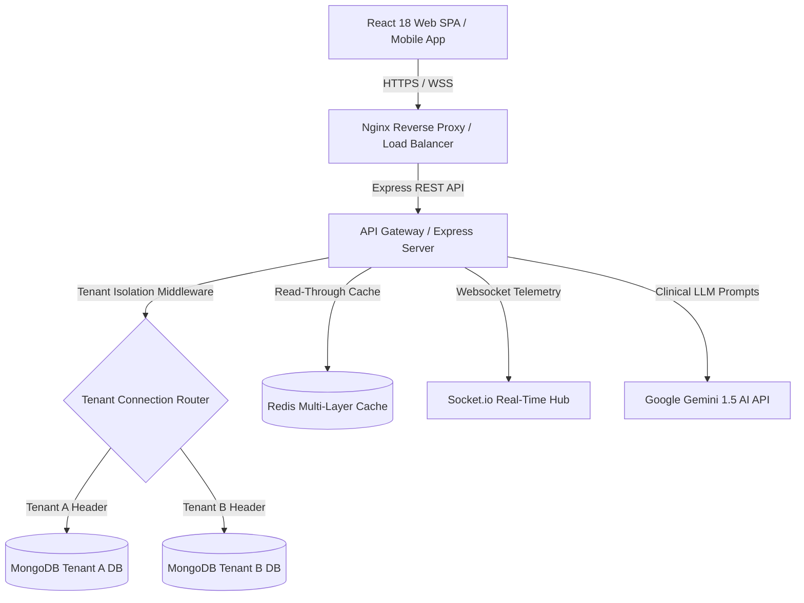
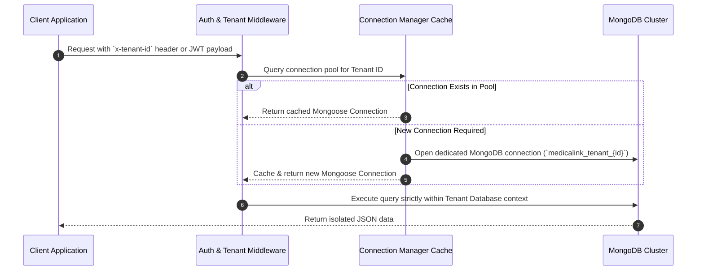
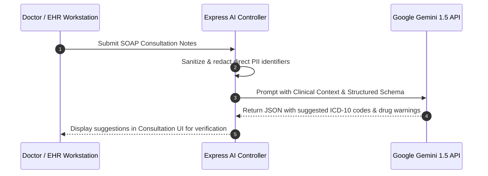

# Technical Architecture & System Design — MedicaLink HMS

System architecture, data models, multi-tenancy mechanics, caching strategy, security safeguards, and AI pipeline details for MedicaLink HMS.

---

## System Architecture Topology



---

## Multi-Tenant Database-per-Tenant Isolation

MedicaLink HMS uses a database-per-tenant isolation strategy. Rather than storing all tenants in shared tables filtered by `tenantId`, each tenant operates against a separate MongoDB database instance (`medicalink_tenant_{id}`).

### Tenant Resolution Lifecycle



---

## Redis Caching Architecture

To support high-concurrency read operations, MedicaLink HMS uses a dual-mode Redis client supporting both ioredis (TCP socket) and Upstash (HTTP REST API).

### Cache Strategy

```
+-------------------------------------------------------------------+
|                        Incoming HTTP GET Request                   |
+-------------------------------------------------------------------+
                                  |
                                  v
                    +---------------------------+
                    |  Cache Key Resolution     |
                    | (tenant:path:query hash)  |
                    +---------------------------+
                                  |
               +------------------+------------------+
               |                                     |
               v                                     v
     [ Cache Hit ]                             [ Cache Miss ]
               |                                     |
    Return Cached JSON payload             Execute Mongoose DB Query
    (Header: X-Cache: HIT)                           |
               |                               Store in Redis (TTL: 300s)
               v                                     v
     Respond in <15ms                      Return Response (X-Cache: MISS)
```

---

## Security & HIPAA Safeguards

```mermaid
graph LR
    subgraph "Edge Security"
        Helmet[Helmet Security Headers]
        Sanitize[express-mongo-sanitize]
        Limiter[Tiered Rate Limiters]
    end

    subgraph "Authentication & Authorization"
        JWT[HttpOnly Access/Refresh JWT Tokens]
        TOTP[Two-Factor Auth TOTP]
        RBAC[15-Role RBAC / ABAC Matrix]
    end

    subgraph "Data Security"
        AES[AES-256-GCM Field Encryption]
        Audit[Immutable Audit Logging]
    end

    Edge Security --> Authentication & Authorization --> Data Security
```

- **Field-Level PII Encryption:** Sensitive fields (SSN, tax ID, insurance policy ID) are encrypted at rest using AES-256-GCM.
- **RBAC Matrix:** Access is bounded by 15 predefined roles (`SUPER_ADMIN`, `HOSPITAL_ADMIN`, `DOCTOR`, `NURSE`, `PHARMACIST`, `LAB_TECH`, `RECEPTIONIST`, `ACCOUNTANT`, `PATIENT`, etc.).

---

## AI Clinical Decision Support Pipeline


