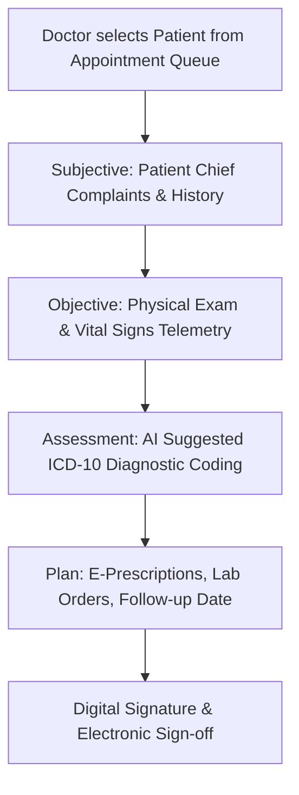

# 📖 Comprehensive User & Module Operational Guide — MedicaLink HMS

This operational guide provides step-by-step instructions for all 25+ modules across the 15 distinct user roles in **MedicaLink HMS**.

---

## 🎯 User Role Matrix & Access Scope

| Role | Target Portal | Core Module Access |
|---|---|---|
| **SUPER_ADMIN** | `/super-admin/*` | Global Tenant Provisioning, System Monitoring, Subscription Plans, Audit Logs |
| **HOSPITAL_ADMIN** | `/admin/*` | Hospital Settings, Staff Directory, Department Management, Compliance Audits |
| **DOCTOR** | `/doctor/*` | Clinical Workstation, SOAP Consultations, E-Prescriptions, Patient Timeline |
| **NURSE** | `/nursing/*` | Inpatient Ward Management, Bed Allocation, Medication Administration (MAR) |
| **PHARMACIST** | `/pharmacy/*` | FEFO Dispensing, Drug Inventory, Purchase Orders, Narcotics Register |
| **LAB_TECH** | `/lab/*` | Sample Collection, Test Result Entry, Delta Checks, Pathologist Sign-off |
| **RADIOLOGIST** | `/radiology/*` | Imaging Orders, DICOM Viewer, AI Image Report Generator |
| **PATIENT** | `/patient-portal/*` | Appointment Booking, Lab Results, Prescriptions, AI Symptom Triage Chatbot |

---

## 📋 Key Module Operational Workflows

### 1. Patient Registration & UHID Generation
```
[ Reception Workstation ]
          │
          ▼
Input Patient Demographics (Name, DOB, Phone, Emergency Contact)
          │
          ▼
System Auto-Checks Duplicate Fingerprints (Name + DOB + Phone)
          │
          ▼
Assign Unique Health Identifier (UHID: e.g. UHID-2026-08942)
          │
          ▼
Issue Digital Patient Badge & Activate Patient Portal Account
```

### 2. Clinical EHR SOAP Consultation Workflow


### 3. Pharmacy FEFO (First-Expired, First-Out) Dispensing
1. Navigating to `/pharmacy/dispensing`.
2. Selecting patient prescription order from active queue.
3. System automatically selects inventory batches sorted by **earliest expiration date**.
4. Pharmacist scans barcode/verifies batch number and executes dispensing transaction.
5. Stock levels auto-decrement with real-time stock alert triggers.

### 4. Emergency Manchester Triage Workflow
- **Red (Immediate):** Critical resuscitation cases (Immediate ICU/Trauma Bay allocation).
- **Orange (Very Urgent):** Severe pain/unstable vitals (Target <10 min evaluation).
- **Yellow (Urgent):** Stable vitals requiring diagnostic workup (Target <60 min).
- **Green (Standard):** Minor injuries/mild symptoms.
- **Blue (Non-Urgent):** Routine complaints.

### 5. Patient Portal & AI Symptom Triage Chatbot
1. Patients log in to `/patient-portal`.
2. Click **AI Health Assistant** floating action widget.
3. Enter symptoms in natural language (e.g., *"I have a high fever and persistent dry cough for 3 days"*).
4. Google Gemini AI analyzes symptoms and responds with urgency triage category (e.g., *"Urgent: Schedule consultation with General Practitioner within 24 hours"*).
