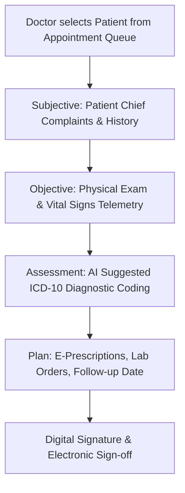

# Comprehensive User & Module Operational Guide — MedicaLink HMS

Operational manual for all 25+ clinical and administrative modules across 15 user roles in MedicaLink HMS.

---

## User Role Scope Matrix

| Role | Target Portal | Core Module Access |
|---|---|---|
| **SUPER_ADMIN** | `/super-admin/*` | Global tenant provisioning, system monitoring, subscription plans, audit logs |
| **HOSPITAL_ADMIN** | `/admin/*` | Hospital settings, staff directory, department management, compliance audits |
| **DOCTOR** | `/doctor/*` | Clinical workstation, SOAP consultations, e-prescriptions, patient timeline |
| **NURSE** | `/nursing/*` | Inpatient ward management, bed allocation, Medication Administration Records (MAR) |
| **PHARMACIST** | `/pharmacy/*` | FEFO dispensing, drug inventory, purchase orders, narcotics register |
| **LAB_TECH** | `/lab/*` | Sample collection, test result entry, delta checks, pathologist verification |
| **RADIOLOGIST** | `/radiology/*` | Imaging orders, DICOM viewer, AI report generator |
| **PATIENT** | `/patient-portal/*` | Appointment booking, lab results, prescriptions, AI symptom triage chatbot |

---

## Operational Workflows

### 1. Patient Registration & UHID Generation
```
[ Reception Workstation ]
          │
          ▼
Input Patient Demographics (Name, DOB, Phone, Emergency Contact)
          │
          ▼
System Auto-Checks Duplicate Fingerprints (Name + DOB + Phone)
          │
          ▼
Assign Unique Health Identifier (UHID: e.g. UHID-2026-08942)
          │
          ▼
Issue Digital Patient Badge & Activate Patient Portal Account
```

### 2. Clinical EHR SOAP Consultation Workflow


### 3. Pharmacy FEFO (First-Expired, First-Out) Dispensing
1. Navigate to `/pharmacy/dispensing`.
2. Select patient prescription order from active queue.
3. System automatically pre-selects inventory batches sorted by earliest expiration date.
4. Pharmacist verifies batch number and executes dispensing transaction.
5. Stock levels decrement with automated threshold alerts.

### 4. Emergency Manchester Triage Workflow
- **Red (Immediate):** Critical resuscitation cases (Immediate ICU/Trauma Bay allocation).
- **Orange (Very Urgent):** Severe pain/unstable vitals (Target <10 min evaluation).
- **Yellow (Urgent):** Stable vitals requiring diagnostic workup (Target <60 min).
- **Green (Standard):** Minor injuries/mild symptoms.
- **Blue (Non-Urgent):** Routine complaints.

### 5. Patient Portal & AI Triage Chatbot
1. Log in to `/patient-portal`.
2. Open **AI Health Assistant** widget.
3. Enter symptoms in natural language.
4. Google Gemini API processes input against clinical schema and returns urgency categorization.
